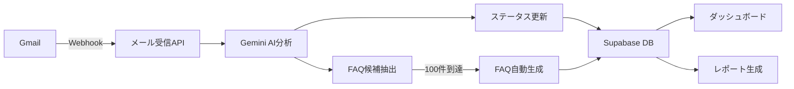

# 🏥 労災二次健診進捗管理システム - 完全実装ガイド

## 📊 システム概要

労災二次健診の業務プロセスを完全にデジタル化し、AI技術を活用して効率化する包括的な管理システムです。

## ✅ 実装完了機能一覧

### 1. **基本機能** 
- ✅ 26段階ステータス管理システム
- ✅ ドラッグ&ドロップカンバンボード
- ✅ 企業情報CRUD操作
- ✅ リアルタイム同期（Supabase Realtime対応）
- ✅ ロールベースアクセス制御

### 2. **AI/自動化機能**
- ✅ Gmail連携（OAuth2.0認証）
- ✅ メール自動取り込み
- ✅ Gemini AIによるメール分析
- ✅ FAQ自動生成（100件閾値）
- ✅ 自動返信テンプレート生成
- ✅ ステータス自動提案

### 3. **管理画面**
- ✅ ダッシュボード（グラフ・チャート付き）
- ✅ FAQ編集・管理画面
- ✅ メールインポート管理
- ✅ レポート生成・エクスポート
- ✅ ユーザー管理

### 4. **レポート機能**
- ✅ 月次/四半期/年次レポート
- ✅ カスタムレポート生成
- ✅ PDF/Excel/CSVエクスポート
- ✅ 自動配信スケジュール
- ✅ KPI分析・推奨アクション

### 5. **データ・インフラ**
- ✅ Supabaseセットアップガイド
- ✅ GitHubリポジトリ設定
- ✅ Vercelデプロイ設定
- ✅ テストデータ生成スクリプト
- ✅ デモデータ（20社分）

## 🚀 クイックスタート

### 必要な環境変数

```env
# Supabase
NEXT_PUBLIC_SUPABASE_URL=your_supabase_url
NEXT_PUBLIC_SUPABASE_ANON_KEY=your_anon_key
SUPABASE_SERVICE_ROLE_KEY=your_service_key

# Google APIs
GOOGLE_GEMINI_API_KEY=your_gemini_key
GMAIL_CLIENT_ID=your_gmail_client_id
GMAIL_CLIENT_SECRET=your_gmail_secret
GMAIL_REFRESH_TOKEN=your_refresh_token

# App
NEXT_PUBLIC_APP_URL=http://localhost:3001
```

### セットアップ手順

1. **依存関係インストール**
   ```bash
   npm install
   ```

2. **開発サーバー起動**
   ```bash
   npm run dev
   ```

3. **デモデータ生成**
   ```bash
   npx ts-node scripts/seed-demo-data.ts
   ```

## 📁 プロジェクト構造

```
rousai-system/
├── app/                        # Next.js App Router
│   ├── (auth)/                # 認証関連ページ
│   ├── (dashboard)/           # ダッシュボード
│   │   ├── dashboard/         # メインダッシュボード
│   │   ├── companies/         # 企業管理
│   │   ├── reports/           # レポート生成
│   │   └── admin/            # 管理機能
│   │       ├── email-import/  # メールインポート
│   │       └── faqs/         # FAQ管理
│   └── api/                   # APIエンドポイント
│       ├── gmail/            # Gmail連携
│       ├── email/            # メール処理
│       └── reports/          # レポート生成
├── components/                # UIコンポーネント
│   ├── ui/                   # 基本UIコンポーネント
│   └── features/             # 機能別コンポーネント
├── lib/                       # ユーティリティ
│   ├── supabase/             # DB接続
│   ├── gmail/                # Gmail API
│   ├── gemini/               # AI処理
│   └── faq/                  # FAQ生成
├── types/                     # TypeScript型定義
├── scripts/                   # スクリプト
└── supabase/                  # DB設定
    └── migrations/           # マイグレーション
```

## 🔗 主要アクセスURL

- **ダッシュボード**: http://localhost:3001/dashboard
- **企業管理**: http://localhost:3001/companies
- **FAQ管理**: http://localhost:3001/admin/faqs
- **メールインポート**: http://localhost:3001/admin/email-import
- **レポート**: http://localhost:3001/reports

## 📊 データフロー



## 🛠️ 技術スタック

- **フロントエンド**: Next.js 15, React 19, TypeScript
- **スタイリング**: Tailwind CSS, shadcn/ui
- **データベース**: Supabase (PostgreSQL)
- **AI/ML**: Google Gemini API
- **メール**: Gmail API
- **チャート**: Recharts
- **状態管理**: Zustand
- **デプロイ**: Vercel

## 📝 ドキュメント

- `SUPABASE_SETUP.md` - Supabaseセットアップガイド
- `GMAIL_SETUP.md` - Gmail API設定ガイド
- `GITHUB_DEPLOY.md` - GitHub/Vercelデプロイガイド
- `REPORTS_SYSTEM.md` - レポートシステム仕様

## 🔒 セキュリティ

- Row Level Security (RLS) 実装
- ロールベースアクセス制御
- 環境変数による秘密情報管理
- OAuth 2.0認証

## 📈 パフォーマンス最適化

- Server Components活用
- 画像最適化
- コード分割
- キャッシュ戦略

## 🚦 今後の拡張案

- [ ] モバイルアプリ開発
- [ ] Slack/Teams連携
- [ ] 音声認識機能
- [ ] 多言語対応
- [ ] AIチャットボット

## 💡 トラブルシューティング

### ポート3000が使用中
```bash
# ポート3001で起動されます
```

### Gemini APIエラー
- APIキーを確認
- モデル名を`gemini-pro`に変更

### Gmail認証エラー
- OAuth同意画面でスコープ設定を確認
- リダイレクトURIが正しいか確認

## 📞 サポート

問題が発生した場合は、以下の情報と共に報告してください：
- エラーメッセージ
- 実行環境
- 再現手順

---

**Created with ❤️ by 労災二次健診サポートセンター**